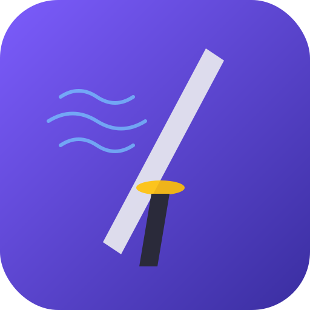

<p align="center">
  
</p>

<h1 align="center">StreamShōgun</h1>

<p align="center">
  <strong>A modern desktop IPTV player built with Electron, React, and TypeScript.</strong><br />
  Manage M3U playlists · Browse XMLTV programme guides · Watch HLS streams
</p>

<p align="center">
  <a href="https://github.com/stream-shogun/stream-shogun/actions/workflows/ci.yml">
    
  </a>
  <a href="LICENSE">
    
  </a>
  
  
  
  
</p>

---

## Features

| Feature                   | Description                                                                                            |
| ------------------------- | ------------------------------------------------------------------------------------------------------ |
| **M3U Playlist Parser**   | Full-spec M3U/M3U8 parser with attribute extraction, EPG source discovery, and malformed-line tracking |
| **XMLTV Programme Guide** | Parse XMLTV/EPG files, index by channel + time, and render a virtualised grid                          |
| **HLS Playback**          | Adaptive bitrate streaming via hls.js with auto-detect, retry, and clean teardown                      |
| **Channel Zapper**        | Quick prev/next navigation with keyboard shortcuts                                                     |
| **SQLite Persistence**    | Playlists, channels, EPG data, and favourites stored locally via better-sqlite3 (WAL mode)             |
| **Multi-Language**        | English, Spanish, and Japanese out of the box                                                          |
| **Dark Theme**            | Dark-first design with CSS custom properties                                                           |
| **Secure Architecture**   | Context isolation, sandbox, no `nodeIntegration`, validated IPC bridge                                 |
| **Cross-Platform**        | Windows (NSIS + portable), macOS (DMG), Linux (AppImage + deb)                                         |

## Screenshots

> **Coming soon** — replace these placeholders with actual screenshots.

| Library                                                             | Channels                                                              | Guide                                                           | Player                                                            |
| ------------------------------------------------------------------- | --------------------------------------------------------------------- | --------------------------------------------------------------- | ----------------------------------------------------------------- |
|  |  |  |  |

## Architecture

```
┌──────────────────────────────────────────────────────────────────┐
│                        Electron Main Process                     │
│                                                                  │
│  ┌──────────┐  ┌──────────────┐  ┌────────────────────────────┐ │
│  │  main.ts │  │   ipc.ts     │  │  db/                       │ │
│  │  (app    │  │  (handlers + │  │  ├─ database.ts (init/WAL) │ │
│  │   life-  │──│   security   │──│  ├─ migrations.ts (v1)     │ │
│  │   cycle) │  │   validation)│  │  └─ repositories.ts (CRUD) │ │
│  └──────────┘  └──────┬───────┘  └────────────────────────────┘ │
│                        │                                         │
│                  preload.ts                                      │
│                  (contextBridge)                                  │
├────────────────────────┼─────────────────────────────────────────┤
│                        │ IPC (invoke/handle)                     │
├────────────────────────┼─────────────────────────────────────────┤
│                        ▼                                         │
│               Renderer Process (sandboxed)                       │
│                                                                  │
│  ┌─────────────────────────────────────────────────────────────┐ │
│  │  React 18 + Vite 5                                         │ │
│  │                                                             │ │
│  │  ┌──────────┐ ┌───────────┐ ┌─────────┐ ┌──────────────┐  │ │
│  │  │ Library  │ │ Channels  │ │  Guide  │ │   Player     │  │ │
│  │  │ (M3U/EPG │ │ (search,  │ │ (EPG    │ │ (HLS via     │  │ │
│  │  │  loader) │ │  groups,  │ │  grid,  │ │  hls.js,     │  │ │
│  │  │          │ │  favs)    │ │  detail)│ │  zapper)     │  │ │
│  │  └──────────┘ └───────────┘ └─────────┘ └──────────────┘  │ │
│  │                                                             │ │
│  │  ┌────────────────────────────────────────────────────────┐ │ │
│  │  │  Zustand Store (app-store.ts)                          │ │ │
│  │  │  localStorage + DB-backed persistence                  │ │ │
│  │  └────────────────────────────────────────────────────────┘ │ │
│  └─────────────────────────────────────────────────────────────┘ │
│                                                                  │
├──────────────────────────────────────────────────────────────────┤
│                    @stream-shogun/core                            │
│  ┌────────────┐ ┌───────────────┐ ┌───────────┐ ┌────────────┐ │
│  │  types.ts  │ │ m3u-parser.ts │ │ xmltv-    │ │ epg-       │ │
│  │  (IPC ch., │ │ (39 tests)    │ │ parser.ts │ │ index.ts   │ │
│  │   iptv,    │ │               │ │ (57 tests)│ │            │ │
│  │   xmltv)   │ │               │ │           │ │            │ │
│  └────────────┘ └───────────────┘ └───────────┘ └────────────┘ │
└──────────────────────────────────────────────────────────────────┘
```

## Project Structure

```
stream-shogun/
├── .github/
│   ├── ISSUE_TEMPLATE/          # Bug report & feature request templates
│   ├── workflows/
│   │   ├── ci.yml               # Lint, typecheck, test, build
│   │   └── release.yml          # Tag-triggered multi-platform release
│   ├── dependabot.yml           # Automated dependency updates
│   └── PULL_REQUEST_TEMPLATE.md
├── apps/
│   ├── desktop/                 # Electron main process
│   │   ├── build/               # App icons (electron-builder)
│   │   ├── scripts/             # Dev launcher
│   │   ├── src/
│   │   │   ├── db/              # SQLite: database, migrations, repositories
│   │   │   ├── ipc.ts           # IPC handlers with security validation
│   │   │   ├── main.ts          # App lifecycle, window creation
│   │   │   └── preload.ts       # contextBridge IPC surface
│   │   ├── electron-builder.yml # Packaging config (win/mac/linux)
│   │   ├── package.json
│   │   └── tsconfig.json
│   └── ui/                      # React renderer
│       ├── src/
│       │   ├── components/      # Sidebar, Welcome, EpgGrid, HlsPlayer, etc.
│       │   ├── hooks/           # useVirtualRows
│       │   ├── lib/             # bridge, i18n, persistence, sample-data
│       │   ├── pages/           # Library, Channels, Guide, Player
│       │   ├── stores/          # Zustand app store
│       │   ├── App.tsx          # Root shell
│       │   └── App.css          # Full application styles
│       ├── package.json
│       └── vite.config.ts
├── packages/
│   └── core/                    # Shared library
│       ├── data/                # Test fixtures (M3U, XMLTV)
│       ├── src/
│       │   ├── __demo__/        # Parser demo/test runners
│       │   ├── m3u-parser.ts    # M3U/M3U8 parser (39 tests)
│       │   ├── xmltv-parser.ts  # XMLTV parser (57 tests)
│       │   ├── epg-index.ts     # EPG time-range indexing
│       │   ├── types.ts         # IPC channels, app config types
│       │   ├── iptv-types.ts    # Channel, Playlist, EpgSource
│       │   └── xmltv-types.ts   # Programme, XmltvData
│       ├── package.json
│       └── tsconfig.json
├── assets/                      # SVG icon source
├── scripts/                     # Build utilities (clean, icon gen)
├── .editorconfig
├── .eslintrc.cjs
├── .gitattributes
├── .gitignore
├── .prettierignore
├── .prettierrc
├── CHANGELOG.md
├── CODE_OF_CONDUCT.md
├── CONTRIBUTING.md
├── LICENSE                      # MIT
├── README.md
├── SECURITY.md
├── package.json                 # Workspace root
├── pnpm-lock.yaml
├── pnpm-workspace.yaml
└── tsconfig.base.json           # Shared strict TS config
```

## Security Model

StreamShōgun follows the [Electron Security Checklist](https://www.electronjs.org/docs/latest/tutorial/security):

| Control            | Status | Notes                                                         |
| ------------------ | :----: | ------------------------------------------------------------- |
| `contextIsolation` |   ✅   | Renderer cannot access Node.js APIs                           |
| `nodeIntegration`  | ✅ Off | Disabled in all windows                                       |
| `sandbox`          |   ✅   | Process-level sandboxing enabled                              |
| Preload bridge     |   ✅   | Only whitelisted IPC channels exposed                         |
| Input validation   |   ✅   | URL scheme checks, file size limits (25 MB fetch, 50 MB file) |
| Fetch timeout      |   ✅   | 30-second `AbortController` timeout                           |
| No `remote` module |   ✅   | Not imported anywhere                                         |
| WAL-mode SQLite    |   ✅   | Safe concurrent reads during writes                           |

See [SECURITY.md](SECURITY.md) for the full security policy and vulnerability reporting process.

## Prerequisites

| Tool                           | Version            |
| ------------------------------ | ------------------ |
| [Node.js](https://nodejs.org/) | ≥ 18.0.0           |
| [pnpm](https://pnpm.io/)       | ≥ 9.0.0            |
| [Git](https://git-scm.com/)    | Any recent version |

**Windows**: A C++ build toolchain is required for `better-sqlite3`. Install the
["Desktop development with C++" workload](https://visualstudio.microsoft.com/visual-cpp-build-tools/)
from Visual Studio Build Tools, or run:

```powershell
npm install -g windows-build-tools
```

## Installation

```bash
# Clone the repository
git clone https://github.com/stream-shogun/stream-shogun.git
cd stream-shogun

# Install all dependencies (including native modules)
pnpm install
```

## Development

```bash
# Start the full dev environment (Vite HMR + Electron)
pnpm dev

# Or run the UI only in the browser (no Electron)
pnpm dev:ui
```

| Script              | Description                                 |
| ------------------- | ------------------------------------------- |
| `pnpm dev`          | Start Vite dev server + Electron            |
| `pnpm dev:ui`       | Start Vite dev server only (browser)        |
| `pnpm test`         | Run core library tests (96 tests)           |
| `pnpm typecheck`    | TypeScript strict check across all packages |
| `pnpm lint`         | ESLint across the monorepo                  |
| `pnpm lint:fix`     | ESLint with auto-fix                        |
| `pnpm format`       | Prettier format all files                   |
| `pnpm format:check` | Prettier check (CI-friendly)                |
| `pnpm clean`        | Remove all build artifacts                  |

## Production Build

```bash
# Build all packages (core → UI → desktop)
pnpm build

# Platform-specific builds
pnpm build:win      # Windows (NSIS installer + portable)
pnpm build:mac      # macOS (DMG + zip)
pnpm build:linux    # Linux (AppImage + deb)
```

Build artifacts are written to `apps/desktop/release/`.

### Custom Icons

Replace the placeholder icon before your first release:

```bash
# Place a 512×512 PNG at:
apps/desktop/build/icon.png

# Or generate from the SVG source (requires sharp):
pnpm add -D sharp
node scripts/generate-icons.js
```

`electron-builder` will automatically convert the PNG to `.ico` (Windows) and
`.icns` (macOS) at build time.

## Packaging

The project uses [electron-builder](https://www.electron.build/) with config in
`apps/desktop/electron-builder.yml`.

| Platform | Targets                         | Output                                |
| -------- | ------------------------------- | ------------------------------------- |
| Windows  | NSIS installer, portable `.exe` | `release/*.exe`                       |
| macOS    | DMG, zip                        | `release/*.dmg`                       |
| Linux    | AppImage, `.deb`                | `release/*.AppImage`, `release/*.deb` |

### Releasing

1. Update version in `package.json` files and `CHANGELOG.md`.
2. Commit: `git commit -m "chore: release v0.2.0"`
3. Tag: `git tag v0.2.0`
4. Push: `git push origin main --tags`

The [release workflow](.github/workflows/release.yml) will build for all
platforms and create a draft GitHub Release with the artifacts.

## Troubleshooting

### Stream Playback Issues

| Symptom                  | Cause                         | Fix                                                               |
| ------------------------ | ----------------------------- | ----------------------------------------------------------------- |
| Black screen, no error   | Stream URL is not HLS         | StreamShōgun requires `.m3u8` HLS streams                         |
| "CORS error" in console  | Server blocks cross-origin    | The stream server must send `Access-Control-Allow-Origin` headers |
| Stuttering / buffering   | Network bandwidth             | Check your connection; try a lower-quality stream                 |
| "Manifest parsing error" | Malformed `.m3u8`             | Verify the URL loads valid HLS in VLC or Safari                   |
| Audio but no video       | Unsupported codec (e.g. HEVC) | hls.js supports H.264/AAC; HEVC requires native MSE support       |

### Build Issues

| Symptom                                 | Fix                                                                            |
| --------------------------------------- | ------------------------------------------------------------------------------ |
| `better-sqlite3` build fails            | Install C++ build tools (see [Prerequisites](#prerequisites))                  |
| `pnpm install` blocks on native modules | Ensure `pnpm.onlyBuiltDependencies` includes `better-sqlite3`                  |
| TypeScript errors after pulling         | Run `pnpm --filter @stream-shogun/core build` first to regenerate declarations |
| Electron white screen in production     | Verify `apps/ui/dist/` exists and `base: "./"` is set in Vite config           |

## Roadmap

- [ ] VOD / catch-up playback support
- [ ] Channel favourites sync across devices
- [ ] Playlist auto-refresh on schedule
- [ ] EPG reminders and notifications
- [ ] Subtitle / teletext support
- [ ] Picture-in-picture mode
- [ ] Playlist import from Xtream Codes API
- [ ] macOS and Linux native packaging refinements
- [ ] Automated end-to-end tests (Playwright)
- [ ] Plugin system for custom stream sources

## Contributing

Contributions are welcome! Please read the [Contributing Guide](CONTRIBUTING.md)
and our [Code of Conduct](CODE_OF_CONDUCT.md) before submitting a pull request.

## License

[MIT](LICENSE) © StreamShōgun Contributors
